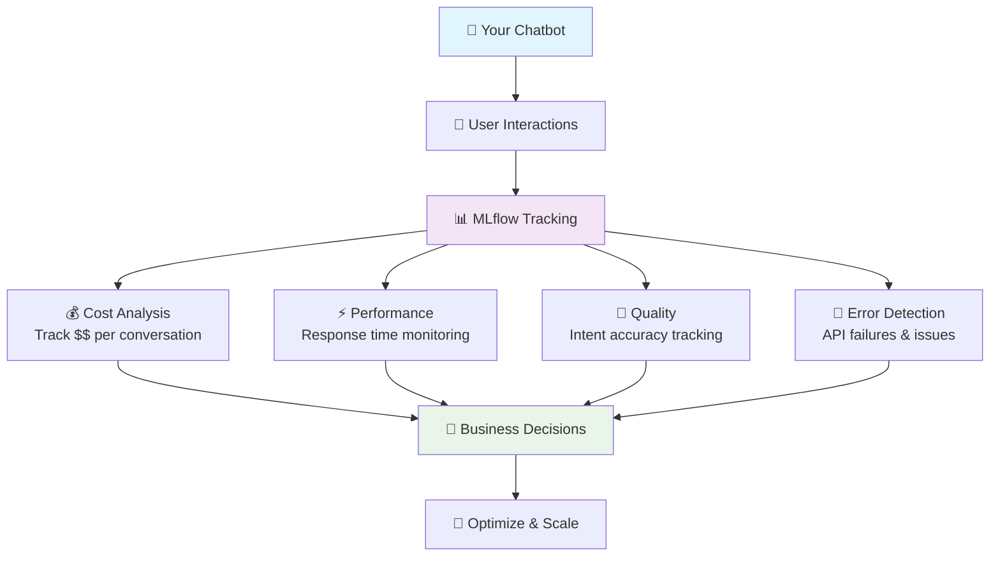

# MLflow Value Diagram

Copy this code and paste it into https://mermaid.live/ to generate and download the image:

## Instructions:
1. Go to https://mermaid.live/
2. Paste the code above
3. Click "Download PNG" or "Download SVG"
